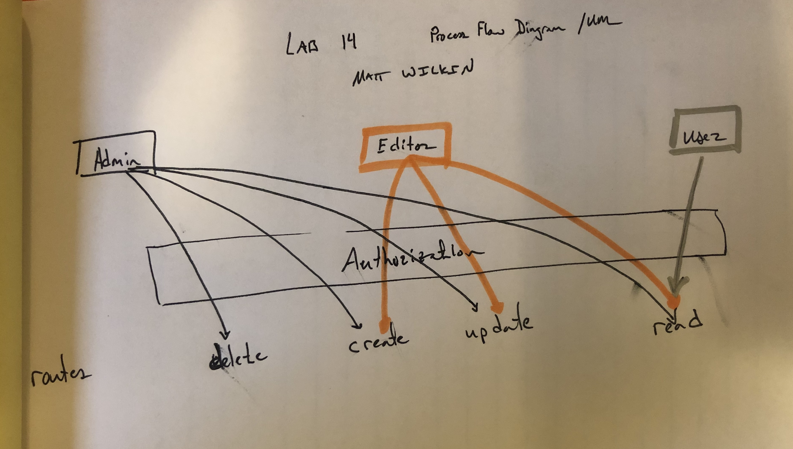

# LAB: Auth-Api-Server

### Author: Matt Wilkin

### Links and Resources
 
* [Heroku-master](https://damp-gorge-26033.herokuapp.com/)

* [Heroku-dev](
https://arcane-badlands-59476.herokuapp.com/)

* [Submission PR](https://github.com/mwilkin-401-advanced-javascript/auth-api-server/pull/3)

* [Travis](https://www.travis-ci.com/mwilkin-401-advanced-javascript/auth-api-server)

### Documentation

* [UML] 

### env setup

refer to env-sample file

### Dependencies

  bcrypt
  cors 
  debug 
  dotenv
  eslint
  express
  jest
  jsonwebtoken
  mongodb-memory-server
  mongoose
  mongoose-schema-jsonschema
  morgan
  require-directory
  supertest
  swagger-ui-express
  express-swagger-generator

### Setup

Running the app

`npm i`

`npm start`

### Tests

How do you run tests?

`npm test`
